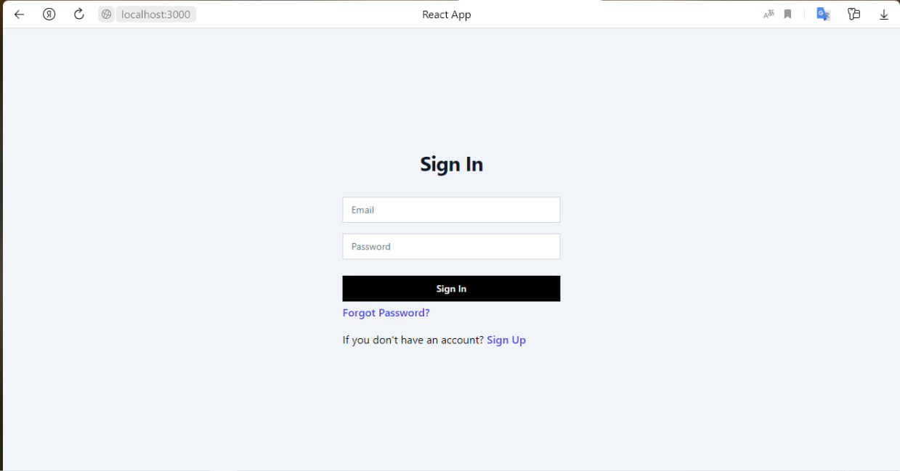
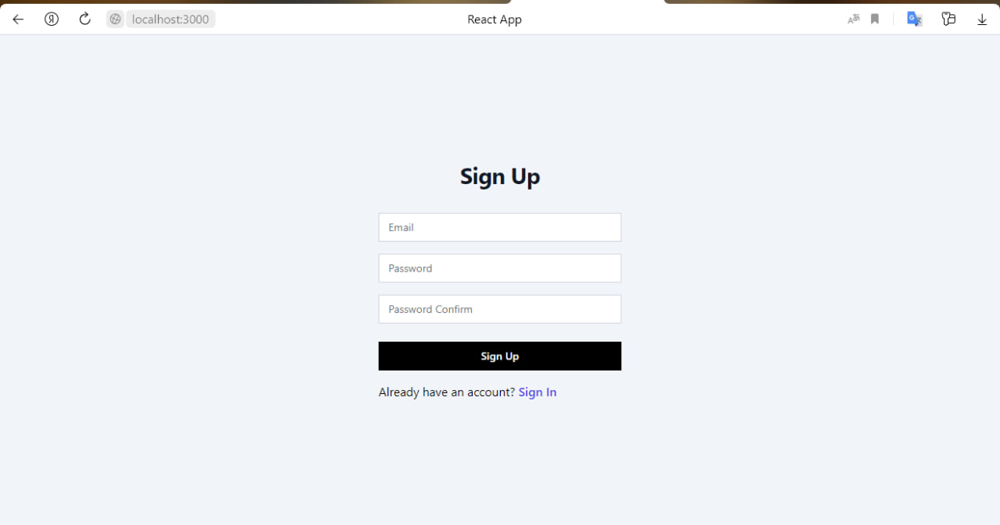
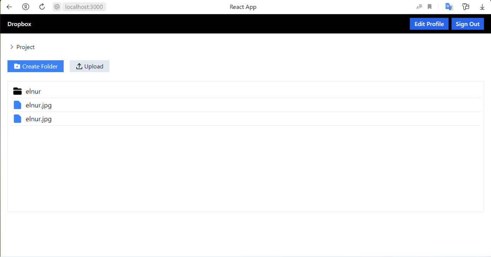
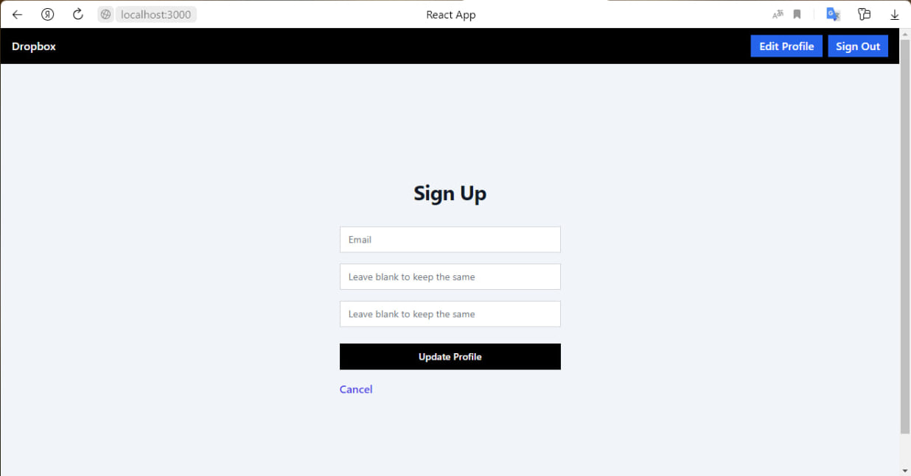
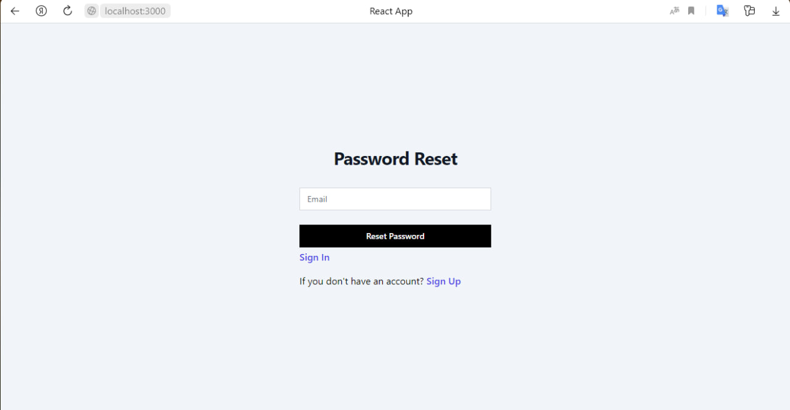

# Welcome to My Dropbox
Welcome to our project Dropbox

## Task
Dropbox is a file hosting service operated by the American company Dropbox, Inc., headquartered in San Francisco, California, that offers cloud storage, file synchronization, personal cloud, and client software.

## Demo 
https://illustrious-mousse-0e02ce.netlify.app

## Description
- User - authentification
- Upload a file
- Versioning
- DNS/Routing

## Installation
you need install node module ``` npm i ``` and write in terminal for run code ``` npm start ```

## Usage
No more than 1 components per file.
Additionals components will be in src/components/
```
./my_project argument1 argument2
```

## Photo






### The Core Team
Tolqinov Elnur and Ziyomidinov Dilshod

<span><i>Made at <a href='https://qwasar.io'>Qwasar SV -- Software Engineering School</a></i></span>
<span></span>
